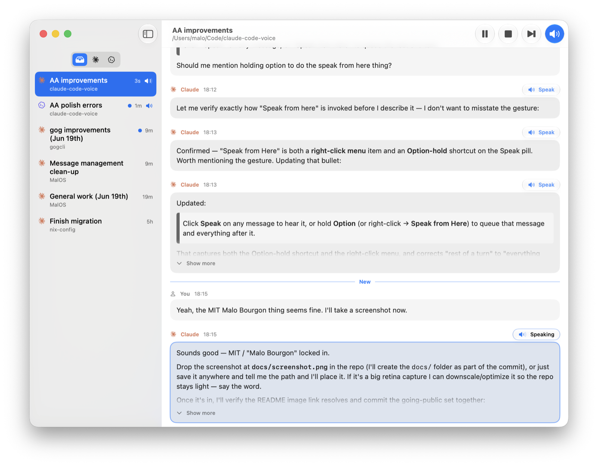

# Agents Aloud

**Listen to your agents instead of reading them.** A macOS app that reads your
Claude Code and Codex sessions aloud.

<!-- Drop a screenshot at docs/screenshot.png before publishing. -->


## Why

I built this for myself because I'd rather listen than read. My agents put out
a lot of text — across coding and plenty of other work — and I wanted an easy
way to take in what they're saying by ear: following an explanation, catching
the gist of a turn, keeping up with several agents at once, instead of reading
every message off the screen.

## Features

- **Unified, live sidebar.** Your active Claude Code sessions (read from the
  live-process registry, so they show up the moment you start one) and your
  recent Codex sessions, merged and sorted by most recent activity. Filter to
  one source, and see an unseen-activity dot on conversations that moved since
  you last looked.

- **Live Speak.** Switch it on for a session and new assistant messages are
  read aloud automatically as they arrive. Turn it on for several sessions at
  once and they share a single playback queue.

- **Cross-session cues.** When playback crosses from one conversation to
  another, you first hear *"From [session name]"*, so an interleaved stream
  stays easy to follow. It stays silent when you're only listening to one
  session.

- **Manual playback and a real queue.** Click **Speak** on any message to hear
  it, or hold **Option** (or right-click → **Speak from Here**) to queue that
  message and everything after it. It all flows through one ordered queue where
  your manual picks take priority over auto-read arrivals. Pause, resume, skip,
  and stop from the toolbar, the Playback menu, the space bar, or your Mac's
  media keys and Now Playing (Control Center, AirPods).

- **Two voices.** The built-in macOS `say` voice, or ElevenLabs streaming with
  your own API key and a voice picker. The system voice uses whatever you've
  chosen in **System Settings → Accessibility → Spoken Content → System
  Voice** — pick a Siri voice there (you may need to download one) for a
  natural result rather than the older default. A words-per-minute slider sets
  the pace; ElevenLabs audio is time-stretched on-device so it stays natural
  even when sped up.

- **Optional spoken rewriter.** Run each message through the Claude or Codex
  CLI before it's spoken, so identifiers, URLs, markup, and code are phrased to
  sound natural aloud instead of being read out character by character. Off by
  default.

- **Chat-style transcript.** The selected session renders as a readable
  conversation with markdown, a marker for where you left off, and a toggle
  between the full stream and final answers only.

- **Glanceable indicator.** The speaker icon animates on whichever session is
  currently talking, so you can tell at a glance which conversation you're
  hearing.

## Requirements

- macOS 26 (Tahoe) or later.
- Xcode 26+ to build (provides the Swift 6 toolchain, the macOS 26 SDK, and
  `actool`).

## Build & run

```sh
./script/build_and_run.sh
```

This builds, stages the SwiftPM resource bundles into the `.app`, compiles the
asset catalog and the Liquid Glass icon, codesigns with your Apple Development
identity, and launches the app. (The codesign step keeps the Keychain ACL
stable across rebuilds — a plain ad-hoc `swift build` would re-prompt for
Keychain access every time.)

Run the tests with `swift test`.

## ElevenLabs (optional)

The default voice is the macOS system voice, which needs no setup. To use
ElevenLabs instead, paste an API key into Settings; it's stored in your login
Keychain.

## Privacy

Agents Aloud reads your local session transcripts **read-only** and never
writes to them:

- **Claude Code** — running processes from `~/.claude/sessions/` and transcripts
  under `~/.claude/projects/`.
- **Codex** — `~/.codex/sessions/` and the session index under `~/.codex/`.

With the default system voice and the rewriter off, nothing leaves your
machine. Two opt-in features send text out, and only ever the message text
being spoken — never your files or the agents' tool output, which aren't part
of the conversation the app shows:

- **ElevenLabs** sends that text to ElevenLabs to synthesize the speech.
- **The rewriter** sends that text through the Claude or Codex CLI — i.e. to
  the same provider already handling that agent — to produce the spoken
  version.

## Status

A personal project that's still evolving quickly. It's reasonably polished and
I use it every day — but it's shaped around my own workflow, so expect to hit
bugs and edge cases that I don't run into. Issues and pull requests are welcome.

Agents Aloud is an independent project and is not affiliated with Anthropic or
OpenAI; "Claude Code" and "Codex" are products of their respective owners.

## License

MIT — see [LICENSE](LICENSE).
